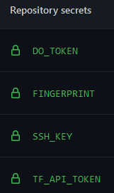
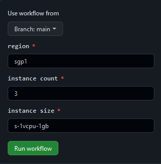

#Secrets to be set
TF_TOKEN terraform token

SSH_KEY public ssh key, that was set in DO

FINGERPRINT fingerprint of public ssh key

DO_TOKEN DigitalOcean token

#Change user-data.web with commands to be executed at bootstrap

# GitHub Actions workflow
1. create droplet
input parameters:
- region (default sgp1)
- size (default s-1vcpu-1gb)
- count (default 3)
2. destroy all (currenlty not working)

